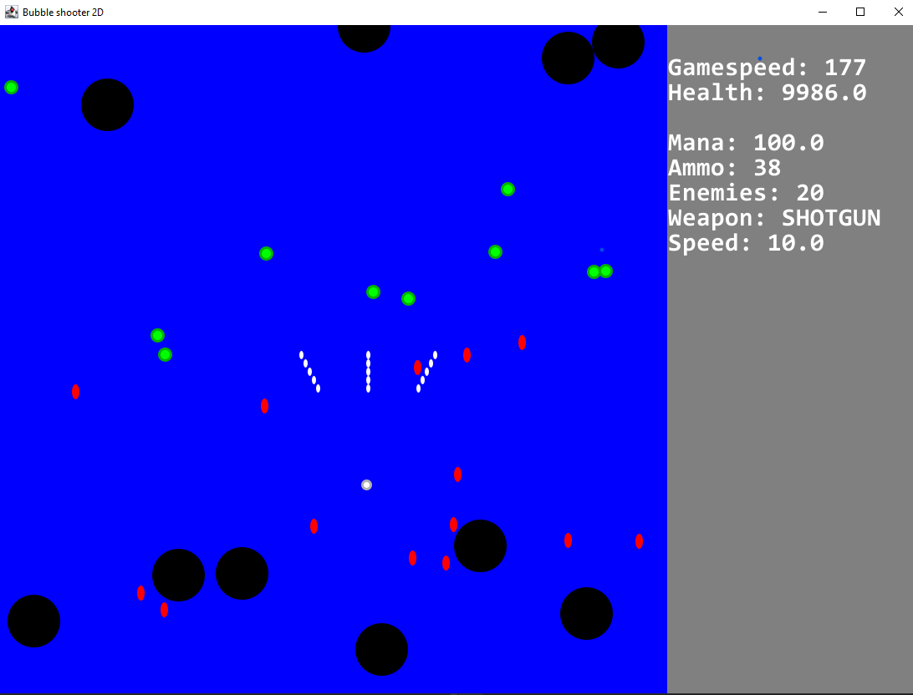

## Bubbleshooter
Bubbleshooter is MIPT Project for the course OOP application development in Java.
It is a 2D top-down game where you have to control a ball and shoot enemies.  
Game based on existing course   [How create Game in Java from the beginning on YouTube](https://www.youtube.com/watch?v=982ndJ9iikQ&ab_channel=%D0%92%D0%B8%D0%BA%D1%82%D0%BE%D1%80%D0%9A%D1%83%D1%80%D1%8B%D1%88%D0%B5%D0%B2)

## Screenshots
 
 
## List of features
- Several types of weapons
- Different enemies
- Mouse and keyboard control (or with keyboard only)
- F - increase fps
- G - reduce fps
- WASD - movement
- LMB - fire with the main weapon
- RMB - fire with an additional weapon
- C - increase speed
- V - decrease speed

## How to run
1. Install JDK
2. Open file support/GameStart
3. Run GameStart Class
